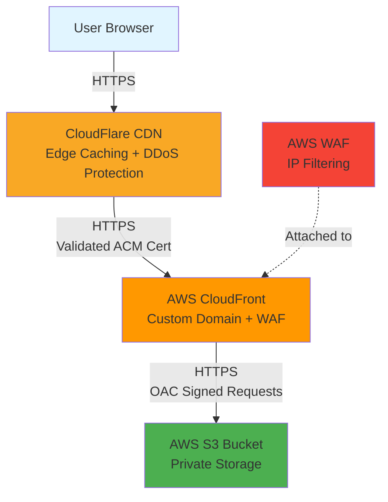
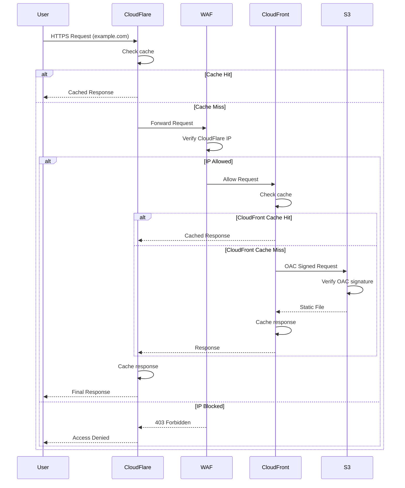

# CLAUDE.md

This file provides guidance to Claude Code (claude.ai/code) when working with code in this repository.

---

## ⚠️ TEMPLATE NOTICE FOR AI AGENTS

**This is a TEMPLATE repository** for building secure, professional static websites with AWS infrastructure.

### If Setting Up a New Website from This Template:

**DO NOT work on code directly yet.** Follow these steps first:

1. **For AI-assisted setup**: See `docs/AI_AGENT_INSTRUCTIONS.md` for guided workflow
2. **For manual setup**:
   - Install dependencies: `npm install`
   - Customize `src/index.html` with your content
   - Update meta tags, titles, and descriptions
   - Replace placeholder text with your website information
   - Test locally: `npm run dev`

3. **Verify setup**:
   - Check that placeholder content was replaced correctly
   - Test locally: `npm run dev` (http://localhost:3000)
   - Review changes before committing

4. **Then proceed** with normal development using the instructions below

### Key Customization Points:

**AWS Configuration**:

- `aws.accountId` - AWS account ID (12 digits)
- `aws.region` - AWS region (recommend: us-east-1)
- `CERTIFICATE_ARN` - ACM certificate ARN (must be in us-east-1)
- `DOMAIN_NAME` - Your custom domain (e.g., "example.com")

**Files to Customize**:

- `src/index.html` - Main landing page content
- `src/assets/images/` - Replace with your images
- `src/assets/icons/` - Replace favicon and app icons
- Environment variables for deployment

**AWS Infrastructure**:

- Create ACM certificate in us-east-1 BEFORE deploying infrastructure
- Set environment variables: `CDK_DEFAULT_ACCOUNT`, `CDK_DEFAULT_REGION`, `CERTIFICATE_ARN`
- Deploy: `npm run infra:deploy`

### Template vs. Production:

- **Template state**: Contains placeholder demonstration content
- **Production state**: After customization, contains your actual website content
- **Development**: Use `npm run dev` to test locally before deployment

---

## Project Overview

Secure, high-performance static website template built with AI assistance. Demonstrates professional web development using modern tooling, AWS infrastructure-as-code, and multi-layer security architecture.

**Technology Stack**: Vanilla JavaScript (ES2021), HTML5, CSS3 (no frameworks)
**Infrastructure**: AWS CDK (TypeScript) for CloudFront + WAF + S3
**Hosting**: AWS S3 + CloudFront + WAF + CloudFlare CDN (multi-layer security)
**Deployment**: Bash scripts + CDK for automated infrastructure and content deployment
**Performance Target**: < 1.5s initial load, Lighthouse score > 95
**Cost**: ~$15/month for production hosting (S3 + CloudFront + Route53)

**IMPORTANT**: All infrastructure must be deployed in us-east-1 region for CloudFront compatibility

## Development Commands

### Local Development

```bash
# Install dependencies (first time only)
npm install

# Start development server on http://localhost:3000 (serves src/ directory)
npm run dev
```

### Code Quality & Linting

```bash
# Run all linters (HTML, CSS, JavaScript)
npm run lint

# Run linters with auto-fix
npm run lint:fix

# Format all code with Prettier
npm run format

# Check formatting without changes
npm run format:check

# Validate everything (format check + all linters)
npm run validate:all

# Individual linters
npm run lint:html       # HTMLHint validation
npm run lint:css        # Stylelint validation
npm run lint:js         # ESLint validation
```

### Build & Optimization

```bash
# Build and validate website (runs build.sh script)
npm run build

# Run all optimizations (CSS minification, JS minification)
npm run optimize

# Individual optimizations
npm run optimize:css    # Minify CSS with clean-css-cli
npm run optimize:js     # Minify JavaScript with Terser
npm run optimize:images # Manual image optimization (placeholder)
```

### Performance Testing

```bash
# Run Lighthouse performance audit (opens in browser)
npm run lighthouse

# Legacy HTML + CSS validation only
npm run validate
```

### Infrastructure Deployment

```bash
# Install CDK dependencies (first time only)
npm run infra:install

# Bootstrap CDK in AWS account (first time only)
npm run infra:bootstrap

# Deploy S3 bucket infrastructure
npm run infra:deploy

# Preview infrastructure changes
npm run infra:diff

# Synthesize CloudFormation template
npm run infra:synth

# Destroy infrastructure (WARNING: deletes bucket)
npm run infra:destroy
```

### Website Deployment

```bash
# Full deployment: build + upload to S3 + invalidate CloudFlare cache
npm run deploy

# Individual deployment steps
npm run build                # Build and validate website (./scripts/build.sh)
npm run deploy:s3            # Upload to S3 bucket (./scripts/deploy.sh)
npm run deploy:cloudflare    # Clear CloudFlare CDN cache (./scripts/invalidate-cache.sh)
```

**Environment Variables Required**:

- `S3_BUCKET_NAME` - Auto-generated: `website-{accountId}-{region}`
- `AWS_REGION` - Default: us-east-1 (required for CloudFront)
- `CDK_DEFAULT_ACCOUNT` - Your AWS account ID (12 digits)
- `CDK_DEFAULT_REGION` - AWS region (must be us-east-1)
- `CERTIFICATE_ARN` - ACM certificate ARN (e.g., `arn:aws:acm:us-east-1:123456789012:certificate/...`)
- `DOMAIN_NAME` - Your custom domain (e.g., `example.com`)
- `CLOUDFRONT_DISTRIBUTION_ID` - From CDK stack output after deployment
- `CLOUDFLARE_ZONE_ID` - For CloudFlare cache invalidation (optional)
- `CLOUDFLARE_API_TOKEN` - For CloudFlare cache invalidation (optional)

**AWS Configuration**:

- Region: us-east-1 (required for CloudFront and ACM certificate)
- CloudFront Domain: Provided in CDK stack output (use as CloudFlare CNAME target)

## Architecture & Code Structure

### High-Level Architecture Pattern

**Secure JAMstack with Multi-Layer CDN + WAF**



**Request Flow Sequence**:



**Architecture Benefits**:

- ✅ **End-to-End Encryption**: HTTPS from user → CloudFlare → CloudFront → S3
- ✅ **Multi-Layer Security**: CloudFlare DDoS + AWS WAF IP filtering + S3 OAC
- ✅ **Performance**: Dual CDN caching (CloudFlare edge + CloudFront regional)
- ✅ **Access Control**: WAF allows only CloudFlare IPv4/IPv6 ranges, S3 allows only CloudFront OAC
- ✅ **Certificate Management**: ACM certificate in us-east-1 with automatic renewal
- ✅ **Cost Efficient**: ~$15/month for production hosting

**Security Layers**:

1. **CloudFlare**: Edge caching, DDoS protection, SSL/TLS termination
2. **AWS WAF**: IP-based filtering, allows only CloudFlare IP ranges (IPv4 + IPv6)
3. **CloudFront OAC**: Origin Access Control with signed requests to S3
4. **S3 Bucket Policy**: Allows only CloudFront service principal with distribution ARN validation
5. **Full (Strict) SSL**: CloudFlare validates CloudFront's ACM certificate

**Infrastructure Deployment Flow**:

```mermaid
graph LR
    A[Create ACM Certificate<br/>in us-east-1] --> B[Add DNS Validation<br/>Records]
    B --> C[Wait for Certificate<br/>Validation]
    C --> D[Set Environment<br/>Variables]
    D --> E[Run CDK Bootstrap<br/>First Time Only]
    E --> F[Deploy CDK Stack<br/>CloudFront + WAF + S3]
    F --> G[Configure CloudFlare<br/>DNS CNAME]
    G --> H[Deploy Website<br/>Content to S3]
    H --> I[Invalidate Caches<br/>CloudFront + CloudFlare]

    style A fill:#4caf50
    style C fill:#ff9800
    style F fill:#2196f3
    style H fill:#9c27b0
    style I fill:#f44336
```



### File Organization

```
/
├── src/                        # Website source files
│   ├── index.html             # Main landing page (single-page design)
│   ├── error.html             # Custom 404 error page
│   ├── html/                  # Example pages (reference only)
│   │   ├── ai_services.example.html   # Example: AI/ML services page
│   │   ├── data_platform.example.html # Example: Data platform projects
│   │   ├── leadership.example.html    # Example: Leadership page
│   │   └── diagrams/          # Architecture diagram examples
│   │       └── .htmlhintrc    # Directory-specific HTMLHint config
│   ├── css/                   # Modular CSS architecture
│   │   ├── main.css           # Core styles, variables, reset, typography, layout
│   │   ├── components.css     # Reusable UI components (cards, grids, badges, timeline)
│   │   ├── themes.css         # Dark/light theme definitions with CSS variables
│   │   └── animations.css     # Keyframes, transitions, scroll effects
│   ├── js/                    # JavaScript modules
│   │   ├── main.js            # Core functionality (nav, scroll, lazy loading)
│   │   ├── theme-toggle.js    # ThemeManager class for dark/light mode
│   │   ├── animations.js      # ScrollReveal, ParallaxScroll, CountUp animations
│   │   ├── modal.js           # ImageModal class for diagram/image viewing
│   │   ├── contact-form.js    # Contact form handler (optional)
│   │   ├── neural-network.js  # Canvas-based neural network animation
│   │   ├── analytics.js       # Privacy-focused analytics tracking
│   │   └── config.js          # Configuration (git-ignored, use config.example.js)
│   └── assets/
│       ├── images/            # Website images and graphics
│       └── icons/             # Favicons and app icons
├── infrastructure/            # AWS CDK infrastructure (CloudFront + WAF + S3)
│   ├── bin/
│   │   └── s3-stack.ts       # CDK app entry point (stack configuration)
│   ├── lib/
│   │   └── website-bucket-stack.ts  # CloudFront + WAF + S3 stack definition
│   ├── cdk.json              # CDK configuration
│   ├── package.json          # CDK dependencies
│   ├── tsconfig.json         # TypeScript configuration
│   └── README.md             # Infrastructure documentation
├── scripts/                   # Deployment automation
│   ├── build.sh              # Build and validate website
│   ├── deploy.sh             # Deploy to S3 with cache headers
│   └── invalidate-cache.sh   # Purge CloudFlare cache
├── docs/
│   ├── DEPLOYMENT_GUIDE.md   # Complete deployment guide for CloudFront + WAF architecture
│   ├── ACM_CERTIFICATE_SETUP.md  # ACM certificate creation in us-east-1 for CloudFront
│   └── CLOUDFLARE_SETUP.md   # CloudFlare CDN configuration guide
├── dist/                      # Build output (git-ignored)
│   ├── css/                  # Minified CSS
│   └── js/                   # Minified JavaScript
```

### CSS Architecture

**Module Responsibilities**:

- `main.css`: CSS variables (`:root`), reset, typography, base layout, header/footer
- `components.css`: Reusable components (cards, project grids, badges, stats, timeline)
- `themes.css`: Color schemes for dark/light modes via `data-theme` attribute
- `animations.css`: Keyframe animations, reveal effects, hover transitions

**Naming Convention**: BEM-inspired, flexible

- Component: `.hero-section`
- Element: `.hero-title`
- Modifier: `.hero-section--dark`

**Theming System**: CSS custom properties switched via `data-theme="dark|light"` on `<html>` element

### JavaScript Architecture

**Design Pattern**: Modular, class-based where appropriate, vanilla JavaScript (no frameworks)

**Key Modules**:

1. **main.js** - Core functionality
   - Mobile menu toggle with accessibility
   - Smooth scroll for anchor links
   - Header scroll effects (shadow on scroll)
   - Active nav link highlighting based on scroll position
   - Lazy image loading via IntersectionObserver
   - Debounce utility for performance
   - Keyboard navigation support

2. **theme-toggle.js** - ThemeManager class (singleton)
   - Dark/light mode switching
   - Persists to `localStorage` as `website-theme`
   - Auto-detects system preference via `prefers-color-scheme`
   - Prevents flash of unstyled content
   - Emits `themechange` custom event

3. **animations.js** - Animation classes
   - `ScrollReveal`: IntersectionObserver-based scroll animations for `.reveal` elements
   - `ParallaxScroll`: Subtle parallax effects using `requestAnimationFrame`
   - `CountUpAnimation`: Animated number counters for stats
   - Respects `prefers-reduced-motion` for accessibility

4. **modal.js** - ImageModal class
   - Manages architecture diagram and service output image modals
   - Maps service cards via `data-modal` attribute to images
   - Supports multiple image types per modal (`architecture`, `output`)
   - Image mapping stored in `imageMap` object
   - Example: `data-modal="recommendation-engine"` → loads images from `imageMap['recommendation-engine']`

5. **contact-form.js** - ContactForm class (optional)
   - Contact form submission handler
   - Client-side form validation (email, required fields)
   - Handles form submission states (loading, success, error)
   - Can be integrated with any form backend service

6. **neural-network.js** - NeuralNetworkBackground class
   - Canvas-based animated neural network visualization for AI-themed backgrounds
   - Automatically initializes on pages with specific container IDs
   - Supports both section-specific (like `#home`) and full-page backgrounds (`.neural-network-background`)
   - 50 animated nodes with AWS-themed colors (orange/blue)
   - Interactive: connections highlight on mouse hover
   - Respects `prefers-reduced-motion` for accessibility
   - Uses `requestAnimationFrame` for 60fps performance

7. **analytics.js** - AnalyticsManager class
   - Privacy-focused event tracking (no PII)
   - Tracks page views, clicks, scroll depth, time on page
   - Core Web Vitals monitoring (LCP, FID, CLS)
   - Beacon API for reliable event sending

**Performance Patterns**:

- IntersectionObserver for scroll-based triggers (no scroll event listeners)
- requestAnimationFrame for smooth animations
- Debouncing for high-frequency events
- Event delegation for dynamic elements
- Lazy loading for images and non-critical resources

### Modal System Architecture (Optional)

The modal system in `modal.js` handles displaying images (architecture diagrams, screenshots, etc.):

**How It Works**:

1. Elements with `data-modal="<modal-id>"` attribute trigger modal
2. Buttons within elements have classes defining modal type
3. Clicking a button finds the parent element via `closest('[data-modal]')`
4. Modal looks up `element.dataset.modal` in `ImageModal.imageMap` object
5. Displays corresponding image

**Image Map Structure**:

```javascript
this.imageMap = {
  'feature-name': {
    screenshot: '/assets/images/feature_screenshot.png',
    architecture: '/assets/images/feature_architecture.png',
  },
};
```

**Adding New Images to Modal**:

1. Add `data-modal="unique-id"` to the element
2. Add button with appropriate class (`.architecture-button`, `.screenshot-button`, etc.)
3. Update `imageMap` in `modal.js` with image paths
4. Store images in `/assets/images/` directory

## Code Quality Infrastructure

### Pre-commit Hooks

**Husky + lint-staged** automatically runs on `git commit`:

- **HTML files**: HTMLHint validation → Prettier formatting
- **CSS files**: Stylelint fix → Prettier formatting
- **JavaScript files**: ESLint fix → Prettier formatting
- **JSON/Markdown**: Prettier formatting

Commits are **blocked** if linting fails. Fix errors or run `npm run lint:fix` before committing.

### Linting Configuration

**HTMLHint** (`.htmlhintrc`):

- Enforces semantic HTML5, lowercase tags/attributes, unique IDs
- Requires `<title>`, `<!DOCTYPE>`, proper tag pairing
- 4-space indentation for HTML
- **Note**: The `html/diagrams/` directory has its own `.htmlhintrc` file with custom rules for diagram-specific HTML files

**Stylelint** (`.stylelintrc.json`):

- Based on `stylelint-config-standard`
- Class naming: `^[a-z][a-zA-Z0-9-]*$` (kebab-case or camelCase)
- Short hex colors, no duplicate properties
- Allows vendor prefixes (`-webkit-`) where needed

**ESLint** (`eslint.config.js` - Flat Config):

- ES2021 features, browser globals defined
- Modern JavaScript: `const`/`let`, arrow functions, template literals, destructuring
- 2-space indentation, single quotes, semicolons required
- Warns on `console.log`, `no-unused-vars`

**Prettier** (`.prettierrc`):

- 100 character line width
- 2-space indentation (CSS/JS), single quotes, semicolons
- LF line endings

### Code Style Standards

**JavaScript**:

- Modern ES2021: `const`/`let`, arrow functions, template literals, destructuring, optional chaining
- Class-based for reusable components (ThemeManager, ImageModal, ScrollReveal)
- Use IntersectionObserver for scroll effects (not scroll event listeners)
- Use `requestAnimationFrame` for animations
- Error handling with try/catch for async operations

**CSS**:

- CSS custom properties for all theme values
- Mobile-first media queries
- Avoid `!important` except for utilities
- Property order: positioning → box model → typography → visual → misc

**HTML**:

- Semantic HTML5 elements (`<header>`, `<nav>`, `<main>`, `<section>`)
- ARIA labels on interactive elements
- Alt text on all images
- 4-space indentation

## Important Patterns & Conventions

### Theme System

**Implementation**: `data-theme` attribute on `<html>` element controls CSS variables

```javascript
document.documentElement.setAttribute('data-theme', 'dark'); // or 'light'
```

**Storage**: `localStorage.getItem('website-theme')` - persists user preference
**System Detection**: `window.matchMedia('(prefers-color-scheme: dark)')`

### Content Cards with Images (Optional)

When adding content cards with images or diagrams:

1. Create card element with `data-modal="unique-id"` attribute
2. Add buttons with appropriate classes (`.architecture-button`, `.screenshot-button`, etc.)
3. Export diagrams as PNG via https://mermaid.live/ (static images preferred)
4. Store images in `/src/assets/images/` with descriptive naming
5. Update `src/js/modal.js` imageMap to include new entries

### Animation Triggers

Elements with class `.reveal` automatically animate on scroll via IntersectionObserver:

- Add stagger delays: `.reveal.stagger-1`, `.reveal.stagger-2`, `.reveal.stagger-3`
- Animation threshold: 15% of element visible (configurable in `animations.js`)
- CSS transition in `animations.css` handles visual effect

### Animated Background System (Optional)

**Full-Page Background Implementation**:

The neural network animation provides an animated background (optional, can be customized):

**HTML Structure**:

```html
<body>
  <!-- Add container at top of body -->
  <div id="page-background" class="neural-network-background"></div>

  <!-- Rest of page content -->
</body>
```

**How It Works**:

1. Container with specific ID is detected by `neural-network.js` on page load
2. Canvas element is created and appended to the container
3. Uses `position: fixed` to cover entire viewport during scroll
4. Animation runs at 60fps using `requestAnimationFrame`
5. Mouse movements create interactive connection highlights
6. Automatically respects `prefers-reduced-motion` accessibility setting

**Adding Background to Page**:

1. Add `<div id="page-background" class="neural-network-background"></div>` at top of `<body>`
2. Add initialization in `neural-network.js` DOMContentLoaded handler
3. Customize colors and particle count as needed
4. Background will automatically cover full viewport and remain visible during scroll

**Note**: The animated background is optional and can be removed if not needed for your website design.

### Contact Form Integration (Optional)

**Contact Form Setup** (if adding a contact form):

- Form can be integrated with any backend service (FormSpree, Netlify Forms, custom API, etc.)
- Success/error messages displayed via `#form-status` element with CSS classes
- Form handler in `contact-form.js` provides client-side validation

**Configuration**:

1. Choose a form backend service (FormSpree, Netlify Forms, or custom API endpoint)
2. Update form action URL to point to your chosen service
3. Configure redirect URL or success handling based on your service
4. Update `contact-form.js` to match your backend's response format

**IMPORTANT**: The `.html` extension is REQUIRED in the redirect URL - without it, CloudFront will treat the path as non-existent and redirect to error.html instead of showing the success message.

**Note**: Contact form is optional. The template includes a single-page landing design by default.

### Error Page Configuration

**Custom 404 Error Page** (`src/error.html`):

- CloudFront error responses configured to serve `/error.html` for 403/404 errors
- Returns proper 404 status code (good for SEO)
- Same hero background styling as homepage
- Apologetic message with navigation options
- Error page cached for 5 minutes
- Configured in `infrastructure/lib/website-bucket-stack.ts` errorResponses section

**Testing Error Page**:

- Visit any non-existent URL (e.g., https://your-domain.com/nonexistent)
- Should display custom error page with consistent branding

### Performance Considerations

- **Critical CSS**: Inline critical styles in `<head>` for faster FCP (planned)
- **Image Loading**: Use `loading="lazy"` for below-fold images, `loading="eager"` for hero images
- **JavaScript**: All scripts use `defer` attribute (execute after DOM parse, maintain order)
- **Caching**: CloudFlare edge caching enabled, S3 cache-control headers set to 1 year for static assets

## Deployment Architecture

### Infrastructure Components

**AWS S3 Bucket**:

- Name: Auto-generated as `website-{accountId}-{region}` (e.g., `website-123456789012-us-east-1`)
- Region: us-east-1 (required)
- Configuration: Private, fully blocked public access
- Access: CloudFront Origin Access Control (OAC) only

**AWS CloudFront Distribution**:

- Custom domains: `your-domain.com` and `www.your-domain.com`
- Origin: S3 bucket via Origin Access Control (OAC)
- SSL/TLS: ACM certificate in us-east-1
- Cache policies: HTML (1 hour), Assets (1 year), Default (24 hours)
- HTTP versions: HTTP/2 and HTTP/3 enabled
- Compression: Gzip and Brotli enabled

**AWS WAF Web ACL**:

- Scope: CLOUDFRONT
- Default action: Block all traffic
- Allow rules: CloudFlare IPv4 and IPv6 ranges only
- Attached to: CloudFront distribution

**ACM Certificate**:

- Region: us-east-1 (required for CloudFront)
- Domain names: `your-domain.com`, `www.your-domain.com`
- Validation: DNS validation via CloudFlare or Route53 CNAME records
- Renewal: Automatic by AWS

**CloudFlare CDN** (optional but recommended):

- SSL/TLS mode: Full (strict) - validates CloudFront certificate
- DNS: CNAME `your-domain.com` → CloudFront distribution domain
- Proxy status: Enabled (orange cloud) - REQUIRED for WAF
- Additional caching layer and DDoS protection

**AWS Configuration**:

- Region: us-east-1 (S3, CloudFront, WAF, CDK stack, ACM certificate)

### Initial Infrastructure Deployment

**Prerequisites**:

1. Create ACM certificate in us-east-1 (see `docs/ACM_CERTIFICATE_SETUP.md`)
2. Add DNS validation records in CloudFlare
3. Wait for certificate validation (10-20 minutes)
4. Set environment variable: `export CERTIFICATE_ARN='arn:aws:acm:us-east-1:...'`

**Deploy Infrastructure**:

```bash
# Set environment variables
export CDK_DEFAULT_ACCOUNT=123456789012  # Your AWS account ID
export CDK_DEFAULT_REGION=us-east-1
export CERTIFICATE_ARN='arn:aws:acm:us-east-1:123456789012:certificate/YOUR_CERT_ID'
export DOMAIN_NAME='your-domain.com'

# Bootstrap CDK (first time only per account/region)
npm run infra:bootstrap

# Deploy CloudFront + WAF + S3 stack
npm run infra:deploy
```

**Stack Outputs** (example):

- `BucketName`: website-123456789012-us-east-1
- `DistributionId`: E123456789ABCD (for cache invalidation)
- `DistributionDomainName`: d123abc456def.cloudfront.net (use as CloudFlare CNAME target)
- `WebACLArn`: WAF Web ACL ARN (CloudFlare IP filtering)
- `WebsiteURL`: https://your-domain.com (if certificate provided)

### Configure CloudFlare DNS

After infrastructure deployment:

1. Log in to CloudFlare dashboard
2. Navigate to DNS → Records
3. Add/Update CNAME record:
   - Name: `@`
   - Target: `{your-cloudfront-domain}.cloudfront.net` (from CDK stack output)
   - Proxy status: **Proxied** (orange cloud - REQUIRED for WAF)
4. Add WWW subdomain CNAME (optional):
   - Name: `www`
   - Target: `{your-cloudfront-domain}.cloudfront.net`
   - Proxy status: **Proxied** (orange cloud)
5. Go to SSL/TLS → Overview
6. Set encryption mode: **Full (strict)** (validates CloudFront ACM certificate)

See `docs/DEPLOYMENT_GUIDE.md` and `docs/CLOUDFLARE_SETUP.md` for detailed configuration.

### Website Content Deployment

**Deployment Flow**:

1. Set environment variables (if not already set):
   ```bash
   export S3_BUCKET_NAME='website-123456789012-us-east-1'
   export CLOUDFRONT_DISTRIBUTION_ID='E123456789ABCD'
   export CLOUDFLARE_ZONE_ID='your-zone-id'  # Optional
   export CLOUDFLARE_API_TOKEN='your-token'  # Optional
   ```
2. `npm run build` - Build and validate website (via ./scripts/build.sh)
3. `npm run deploy:s3` - Upload to S3 with cache headers (via ./scripts/deploy.sh)
4. Invalidate caches:
   - CloudFront: Automatic via `npm run deploy`
   - CloudFlare: `npm run deploy:cloudflare` (if configured)
5. Verify: Check production URL, run Lighthouse audit

**Cache Headers**:

- HTML files: 1 hour (`max-age=3600`)
- CSS/JS files: 1 year (`max-age=31536000`)
- Images: 1 year (`max-age=31536000`)
- Resume PDF: 1 week (`max-age=604800`)

**Cache Invalidation**:

- CloudFront cache must be invalidated after S3 deployment
- CloudFlare cache should be purged for immediate propagation
- Both caches work together for optimal performance

### Pre-Production Deployment Checklist

Before deploying to production, verify the following to avoid common issues:

- [ ] **Environment variables set**: All required env vars configured correctly
- [ ] **Domain name updated**: Replace all localhost URLs with production domain
- [ ] **Contact form configured**: Form backend service configured (if using contact form)
- [ ] **All image paths** are relative (start with `/`) not absolute
- [ ] **All linters pass**: Run `npm run lint` with no errors
- [ ] **Code formatting verified**: Run `npm run format:check` passes
- [ ] **Performance audit**: Run `npm run lighthouse` and verify scores > 95
- [ ] **Theme toggle**: Works correctly and persists across page refreshes
- [ ] **Animations**: Scroll animations trigger correctly, respects prefers-reduced-motion
- [ ] **Cross-browser testing**: Test on Chrome, Firefox, Safari, and mobile browsers
- [ ] **Accessibility**: Run browser accessibility audit (Lighthouse or axe DevTools)
- [ ] **SSL/TLS**: Verify HTTPS works and certificate is valid
- [ ] **CloudFlare proxy**: Orange cloud enabled for WAF protection

**Quick Validation Command**:

```bash
# Run all validations before deployment
npm run validate:all && npm run lighthouse
```

## Common Development Tasks

### Adding a New Page

1. Create HTML file in `/html/` directory (use `src/index.html` as reference)
2. Update `<head>` section with appropriate SEO meta tags:
   - Update `<title>` and meta description
   - Add Open Graph tags (`og:title`, `og:description`, `og:url`, `og:image`)
   - Add Twitter Card tags (`twitter:title`, `twitter:description`, etc.)
   - Add canonical URL: `<link rel="canonical" href="https://your-domain.com/html/page-name.html" />`
   - Add Schema.org structured data with appropriate `@type` (WebPage, ContactPage, etc.)
   - Add resource preloading: `<link rel="preload" href="/css/main.css" as="style" />`
3. Add animated background container (optional):
   ```html
   <div id="page-background" class="neural-network-background"></div>
   ```
4. Update navigation links in all pages (if using multi-page design)
5. Include standard scripts in order: `main.js`, `theme-toggle.js`, `animations.js`, `analytics.js`

### Adding Content Cards

1. Create card structure using existing CSS classes in `components.css`
2. Add: icon/image, title, description, call-to-action button
3. Add `data-modal="unique-id"` if including images/diagrams
4. Create diagram PNG (use https://mermaid.live/ for architecture diagrams)
5. Store images in `/assets/images/` with descriptive naming
6. Update `modal.js` imageMap if using modal functionality

### Creating Architecture Diagrams

1. Write diagram in Mermaid syntax (see examples in `docs/` directory)
2. Export as PNG from https://mermaid.live/
3. Save to `/assets/images/` with descriptive filename
4. Optimize image size (keep under 200KB if possible)
5. Add to imageMap in `modal.js` if using modal display
6. Update alt text in HTML for accessibility

### Updating Theme Colors

1. Edit CSS custom properties in `css/themes.css` under `[data-theme="dark"]` or `[data-theme="light"]`
2. Test theme switching with toggle button
3. Verify color contrast meets WCAG AA (4.5:1 minimum)

### Debugging JavaScript

- Check browser console for errors (global error handler logs all errors)
- Enable ESLint warnings: Check for `no-console`, `no-unused-vars` warnings
- Use browser DevTools Network tab to verify resource loading
- Check localStorage for theme preference: `localStorage.getItem('website-theme')`
- Verify all scripts are loaded in correct order (check Network tab timing)
- Test with different browsers and devices for compatibility issues

## Key Technical Decisions

### Why Vanilla JavaScript?

- Zero framework overhead (saves ~40-150KB)
- Faster initial load time (critical for user experience and SEO)
- Standard APIs, no framework lock-in
- Any developer can contribute without framework knowledge
- Static sites don't require complex state management
- Easier to understand and debug for beginners

### Why No Build Step Required?

- Development: Direct file editing with instant browser refresh
- Debugging: Unminified code easier to debug in DevTools
- Simplicity: No webpack/vite configuration to learn
- Build step optional, only for production optimization

### Why IntersectionObserver for Animations?

- Performance: No scroll event listeners (passive, async)
- Battery efficient: Browser-optimized, no constant polling
- Accuracy: Precise viewport detection with configurable thresholds
- Modern API with graceful fallback for old browsers

### Why CloudFlare + CloudFront (Dual CDN)?

**CloudFront Benefits**:

- Native S3 integration with Origin Access Control (OAC)
- ACM certificate integration for custom domains
- AWS WAF for advanced security rules
- Regional edge caching optimized for AWS services

**CloudFlare Benefits**:

- Free tier with unlimited bandwidth
- More global edge locations (300+)
- DDoS protection included
- Additional caching layer for improved performance

**Combined Architecture**:

- CloudFront provides secure S3 access and WAF filtering
- CloudFlare adds global edge caching and DDoS protection
- End-to-end HTTPS encryption throughout the chain
- WAF restricts CloudFront to CloudFlare IPs only for security

## Troubleshooting

### Pre-commit Hook Failures

- Run `npm run lint:fix` to auto-fix most issues
- Check error output for specific linting violations
- For HTMLHint: Ensure proper tag closing, lowercase attributes, unique IDs
- For Stylelint: Check class naming convention, no duplicate properties
- For ESLint: Remove `console.log`, fix unused variables

### Modal Not Opening

- Verify card has `data-modal` attribute matching imageMap key
- Check button has `.architecture-button` or `.output-button` class
- Verify image path in imageMap is correct and file exists
- Check browser console for JavaScript errors

### Theme Not Persisting

- Check localStorage: `localStorage.getItem('website-theme')`
- Verify `theme-toggle.js` is loaded (check Network tab)
- Clear browser cache and localStorage, test theme toggle
- Ensure storage key matches between HTML and JavaScript

### Contact Form Not Working (if implemented)

- Check browser console for JavaScript errors during form submission
- Verify form action URL points to your chosen backend service
- Test form submission and check Network tab for API response
- Verify redirect URL or success handling is configured correctly
- Check that all required form fields are present and validated

### Development Server Not Starting

- Ensure port 3000 is available: `lsof -ti:3000 | xargs kill -9`
- Reinstall dependencies: `rm -rf node_modules && npm install`
- Check Node.js version compatibility (modern Node.js recommended)

### Infrastructure Deployment Issues

**ACM Certificate Not Found**:

- Verify certificate is in us-east-1 region (required for CloudFront)
- Check `CERTIFICATE_ARN` environment variable is set correctly
- Ensure certificate status is "Issued" in ACM console

**CloudFront Distribution Creation Failed**:

- Verify ACM certificate ARN is correct and valid
- Check that certificate includes your domain and www subdomain
- Ensure WAF Web ACL was created successfully (check CloudFormation events)
- Verify certificate status is "Issued" (not "Pending Validation")

**WAF Blocking Legitimate Traffic**:

- Verify CloudFlare proxy (orange cloud) is enabled in DNS
- Check CloudFlare IP ranges are up to date in `infrastructure/lib/website-bucket-stack.ts`
- Update IP ranges: https://www.cloudflare.com/ips-v4 and https://www.cloudflare.com/ips-v6
- Redeploy infrastructure after updating IP ranges: `npm run infra:deploy`

**403 Forbidden from CloudFront**:

- Check WAF logs in CloudWatch to see if request was blocked
- Verify request is coming from CloudFlare IP (check X-Forwarded-For header)
- Ensure CloudFlare proxy is enabled (orange cloud)

**403 Forbidden from S3**:

- Verify CloudFront Origin Access Control is configured correctly
- Check S3 bucket policy allows CloudFront service principal
- Ensure distribution ID in bucket policy condition matches deployed distribution

**Website Not Loading After Deployment**:

- Check CloudFlare DNS points to CloudFront domain (not S3 endpoint)
- Verify SSL/TLS mode in CloudFlare is "Full (strict)"
- Invalidate both CloudFront and CloudFlare caches
- Check CloudFront distribution status is "Deployed" (not "In Progress")

**CloudFront Cache Not Updating**:

- Run CloudFront invalidation: `aws cloudfront create-invalidation --distribution-id $CLOUDFRONT_DISTRIBUTION_ID --paths "/*"`
- Wait 5-10 minutes for invalidation to complete
- Check invalidation status in CloudFront console
- Also purge CloudFlare cache: `npm run deploy:cloudflare`

## Project Structure Notes

**Source Files**: All website files are in `src/` directory
**Development Server**: `npm run dev` serves from `src/` directory on http://localhost:3000
**Infrastructure as Code**: CloudFront + WAF + S3 deployed via AWS CDK in TypeScript (`infrastructure/` directory)
**Infrastructure Stack**: `Website-production` (CloudFormation stack name)
**S3 Bucket**: Auto-generated as `website-{accountId}-{region}` (private, OAC access only)
**CloudFront Distribution**: Created by CDK (custom domain with ACM certificate)
**CloudFront Domain**: From CDK stack output (use as CloudFlare CNAME target)
**AWS WAF**: CloudFlare IP filtering (IPv4 + IPv6 ranges)
**Region**: us-east-1 (all resources including S3, CloudFront, WAF, CDK stack, ACM certificate)
**Deployment Scripts**: Bash scripts in `scripts/` for automated build, deploy, and cache invalidation
**Build Output**: Minified assets go to `dist/` directory (git-ignored)

**Cost**: ~$15/month (S3 storage + CloudFront requests + Route53 hosted zone)

## Additional Documentation

- **docs/DEPLOYMENT_GUIDE.md**: Complete deployment guide for CloudFront + WAF + CloudFlare architecture, step-by-step setup, security configuration, troubleshooting
- **docs/ACM_CERTIFICATE_SETUP.md**: ACM certificate creation in us-east-1 for CloudFront, DNS validation, certificate renewal
- **docs/CLOUDFLARE_SETUP.md**: CloudFlare CDN configuration guide, DNS setup, SSL/TLS configuration, caching rules
- **infrastructure/README.md**: AWS CDK infrastructure documentation, CloudFront + WAF + S3 stack details, deployment commands
- **README.md**: Setup instructions, deployment workflow, environment variables, troubleshooting
- **package.json**: All npm scripts and dependencies listed with descriptions

## Infrastructure Code Overview

### infrastructure/lib/website-bucket-stack.ts

This is the main CDK stack definition that creates all AWS infrastructure:

**Key Components**:

1. **S3 Bucket** (Private):
   - Name: Auto-generated as `website-{accountId}-{region}`
   - Region: us-east-1 (required for CloudFront)
   - Block all public access
   - Versioning enabled for rollback
   - S3-managed encryption (AES-256)
   - Lifecycle rules for old versions (90 days retention)
   - CORS configuration for web fonts and assets

2. **CloudFlare IP Sets** (for WAF):
   - IPv4 IP Set: 15 CloudFlare IPv4 ranges
   - IPv6 IP Set: 7 CloudFlare IPv6 ranges
   - Source: https://www.cloudflare.com/ips-v4 and https://www.cloudflare.com/ips-v6

3. **AWS WAF Web ACL**:
   - Scope: CLOUDFRONT
   - Default action: Block all traffic
   - Rule 1 (Priority 1): Allow CloudFlare IPv4
   - Rule 2 (Priority 2): Allow CloudFlare IPv6
   - CloudWatch metrics enabled

4. **CloudFront Distribution**:
   - Distribution ID: From CDK stack output
   - Domain: `{random}.cloudfront.net` (from CDK stack output)
   - Custom domains: `your-domain.com`, `www.your-domain.com` (from environment variables)
   - Origin: S3 bucket via Origin Access Control (OAC)
   - ACM certificate: From `CERTIFICATE_ARN` environment variable (must be in us-east-1)
   - Default behavior: REDIRECT_TO_HTTPS, cache 24 hours
   - Additional behavior for `*.html`: cache 1 hour
   - Additional behavior for `/assets/*`: cache 365 days
   - Error responses: 403/404 → 404 with `/error.html` (custom error page)
   - HTTP/2 and HTTP/3 enabled
   - Gzip and Brotli compression
   - WAF attached for IP filtering

5. **S3 Bucket Policy**:
   - Allow `s3:GetObject` from CloudFront service principal only
   - Condition: Source ARN must match CloudFront distribution ARN
   - No other access allowed

**Stack Outputs**:

- BucketName, BucketArn
- DistributionId, DistributionDomainName
- WebACLArn
- WebsiteURL (if certificate provided)

### infrastructure/bin/s3-stack.ts

CDK app entry point that configures the stack:

**Configuration Parameters**:

- `bucketName`: Auto-generated as `website-{accountId}-{region}` or from context
- `domainName`: From `DOMAIN_NAME` environment variable (e.g., `your-domain.com`)
- `certificateArn`: From `CERTIFICATE_ARN` environment variable (ACM cert ARN in us-east-1)
- `environment`: From context or defaults to `production`
- `awsAccount`: From `CDK_DEFAULT_ACCOUNT` environment variable (12 digits)
- `awsRegion`: From `CDK_DEFAULT_REGION` environment variable (us-east-1 required)
- **Note**: Bucket name includes account ID and region for global uniqueness

**Tags Applied**:

- Project: Website (or custom from environment)
- Environment: production (or custom from environment)
- ManagedBy: AWS-CDK
- Domain: From `DOMAIN_NAME` environment variable

### Updating CloudFlare IP Ranges

When CloudFlare updates their IP ranges:

1. Check latest ranges:
   - IPv4: https://www.cloudflare.com/ips-v4
   - IPv6: https://www.cloudflare.com/ips-v6

2. Update `infrastructure/lib/website-bucket-stack.ts`:

   ```typescript
   const cloudflareIPv4Ranges = [
     // Update with new ranges
   ];
   const cloudflareIPv6Ranges = [
     // Update with new ranges
   ];
   ```

3. Redeploy infrastructure:

   ```bash
   npm run infra:deploy
   ```

4. Verify WAF rules are updated in AWS Console
