# Secure Static Website Template

> **🚀 AI-assisted, production-ready website template** with AWS infrastructure, multi-layer security, and professional design.

Build secure, high-performance static websites for ~$15/month using AWS CDK infrastructure-as-code.

## ✨ Features

- ✅ **Multi-Layer Security**: CloudFlare DDoS + AWS WAF + CloudFront OAC
- ✅ **Lightning Fast**: Dual CDN caching (CloudFlare + CloudFront)
- ✅ **Cost Efficient**: ~$15/month for production hosting
- ✅ **Infrastructure as Code**: AWS CDK (TypeScript)
- ✅ **Dark/Light Themes**: Auto-detecting with localStorage persistence
- ✅ **Performance Optimized**: Lighthouse score 95+, < 1.5s load time
- ✅ **Code Quality**: ESLint, Prettier, Husky pre-commit hooks

## 💡 Infrastructure Choices

### Why This Architecture?

This template uses a carefully designed multi-layer architecture that balances **cost**, **security**, and **performance**:

**S3 for Static Hosting**

- Cost-effective storage for static files (~$0.023/GB per month)
- High durability (99.999999999%) and availability (99.99%)
- No server maintenance required
- Pay only for what you use

**CloudFront for Secure Origin Access**

- Secures traffic from CDN to S3 through Origin Access Control (OAC)
- Integrates with AWS Certificate Manager (ACM) for free SSL/TLS certificates
- Automatic certificate renewal (no manual intervention)
- Custom domain support with HTTPS
- AWS WAF integration for IP-based filtering

**CloudFlare for CDN (Primary Edge Caching)**

- **Significantly lower costs**: Free tier includes unlimited bandwidth
- 300+ global edge locations (vs CloudFront's 400+)
- Superior performance for static content delivery
- DDoS protection included at no extra cost
- Additional layer of caching reduces CloudFront requests

**Security Through Allowlisting**

- CloudFront configured with AWS WAF to **allowlist only CloudFlare IP ranges**
- Multi-layer defense: CloudFlare DDoS protection → WAF IP filtering → CloudFront OAC → Private S3
- End-to-end HTTPS encryption throughout the chain
- No direct S3 access - everything goes through CloudFront

**Cost Breakdown (~$15/month)**

- S3 storage: ~$1-2/month (depends on content size)
- CloudFront: ~$8-10/month (data transfer, reduced by CloudFlare caching)
- Route53 (DNS): ~$0.50/month per hosted zone
- ACM certificates: **FREE**
- CloudFlare CDN: **FREE** (unlimited bandwidth on free tier)

This architecture delivers enterprise-grade performance and security at **~95% less cost** than traditional hosting solutions.

## 🏗️ Architecture

### Request Flow


### Infrastructure Deployment Flow

```mermaid
graph LR
    A[Create ACM Certificate<br/>in us-east-1] --> B[Add DNS Validation<br/>Records]
    B --> C[Wait for Certificate<br/>Validation]
    C --> D[Set Environment<br/>Variables]
    D --> E[Run CDK Bootstrap<br/>First Time Only]
    E --> F[Deploy CDK Stack<br/>CloudFront + WAF + S3]
    F --> G[Configure CloudFlare<br/>DNS CNAME]
    G --> H[Deploy Website<br/>Content to S3]
    H --> I[Invalidate Caches<br/>CloudFront + CloudFlare]

    style A fill:#4caf50
    style C fill:#ff9800
    style F fill:#2196f3
    style H fill:#9c27b0
    style I fill:#f44336
```



### Security Layers


**Benefits**:

- ✅ End-to-end HTTPS encryption
- ✅ CloudFlare DDoS protection
- ✅ WAF IP filtering (CloudFlare IPs only)
- ✅ S3 private access (CloudFront OAC only)
- ✅ ACM certificate auto-renewal

## 🚀 Quick Start

### Prerequisites

- Node.js 18+ and npm
- AWS CLI configured with credentials
- AWS account (any region, but us-east-1 required for CloudFront)
- CloudFlare account (optional but recommended)

### 1. Install Dependencies

```bash
npm install
npm run infra:install  # CDK dependencies
```

### 2. Customize Content

Edit `src/index.html` with your website content:

- Update hero section
- Customize feature cards
- Replace placeholder text
- Update meta tags and SEO

### 3. Local Development

```bash
npm run dev  # http://localhost:3000
```

### 4. Deploy Infrastructure

See [`docs/DEPLOYMENT_GUIDE.md`](docs/DEPLOYMENT_GUIDE.md) for complete setup.

**Quick deployment**:

```bash
# Create ACM certificate first (see docs/ACM_CERTIFICATE_SETUP.md)

# Set environment variables
export CDK_DEFAULT_ACCOUNT=123456789012
export CDK_DEFAULT_REGION=us-east-1
export CERTIFICATE_ARN='arn:aws:acm:us-east-1:...'
export DOMAIN_NAME='your-domain.com'

# Deploy infrastructure
npm run infra:bootstrap  # First time only
npm run infra:deploy

# Deploy website
npm run deploy
```

## 📁 Project Structure

```
/
├── src/                    # Website source files
│   ├── index.html         # Main landing page
│   ├── error.html         # Custom 404 page
│   ├── html/              # Example pages (reference only)
│   ├── css/               # Modular CSS
│   ├── js/                # JavaScript modules
│   └── assets/            # Images, icons
├── infrastructure/        # AWS CDK (TypeScript)
│   ├── bin/s3-stack.ts   # CDK app entry
│   └── lib/website-bucket-stack.ts  # Stack definition
├── scripts/               # Deployment automation
│   ├── build.sh          # Build and validate
│   ├── deploy.sh         # Deploy to S3
│   └── invalidate-cache.sh  # Clear CloudFlare cache
├── docs/                  # Documentation
│   ├── DEPLOYMENT_GUIDE.md
│   ├── ACM_CERTIFICATE_SETUP.md
│   └── CLOUDFLARE_SETUP.md
└── dist/                  # Build output (git-ignored)
```

## 🛠️ Development Commands

### Local Development

```bash
npm run dev              # Start dev server (http://localhost:3000)
```

### Code Quality

```bash
npm run lint             # Run all linters (HTML, CSS, JS)
npm run lint:fix         # Auto-fix linting issues
npm run format           # Format all code with Prettier
npm run validate:all     # Run format check + all linters
```

### Building & Deployment

```bash
npm run build            # Build and validate website
npm run deploy           # Full deployment (build + S3 + cache invalidation)
npm run deploy:s3        # Deploy to S3 only
npm run deploy:cloudflare # Purge CloudFlare cache
```

### Infrastructure

```bash
npm run infra:bootstrap  # Bootstrap CDK (first-time only)
npm run infra:deploy     # Deploy CloudFront + WAF + S3 stack
npm run infra:diff       # Show stack differences
npm run infra:destroy    # Destroy infrastructure (WARNING)
```

### Performance Testing

```bash
npm run lighthouse       # Run Lighthouse audit
```

## 🎨 Tech Stack

- **Frontend**: Vanilla JavaScript (ES2021), HTML5, CSS3
- **Infrastructure**: AWS CDK (TypeScript)
- **Hosting**: AWS S3 + CloudFront + WAF
- **CDN**: CloudFlare (optional but recommended)
- **Security**: Multi-layer (CloudFlare + WAF + OAC)
- **Cost**: ~$15/month (S3 + CloudFront + Route53)

### Why This Stack?

- **Vanilla JavaScript**: Zero framework overhead, faster load times
- **AWS CDK**: Infrastructure as code, version controlled
- **CloudFlare + CloudFront**: Dual CDN for performance and security
- **No Build Step Required**: Direct file editing in development

## 🔒 Security

### Multi-Layer Protection

1. **CloudFlare**: Edge caching, DDoS protection, SSL/TLS termination
2. **AWS WAF**: IP-based filtering (allows only CloudFlare IPs)
3. **CloudFront OAC**: Origin Access Control with signed requests
4. **S3 Bucket Policy**: CloudFront service principal only
5. **Full (Strict) SSL**: End-to-end encryption

### Best Practices

- ✅ S3 bucket blocks all public access
- ✅ HTTPS enforced throughout the chain
- ✅ ACM certificate with automatic renewal
- ✅ WAF blocks all traffic except CloudFlare IPs
- ✅ No sensitive data in client-side code
- ✅ Environment variables for all credentials

## 📊 Performance

### Targets

- **Performance**: 95+ (Lighthouse)
- **Accessibility**: 95+ (Lighthouse)
- **Best Practices**: 95+ (Lighthouse)
- **SEO**: 95+ (Lighthouse)
- **Initial Load**: < 1.5s

### Optimizations

- ✅ CloudFlare global edge caching (300+ locations)
- ✅ CloudFront regional edge caching
- ✅ Brotli and Gzip compression
- ✅ Auto minification (HTML, CSS, JS)
- ✅ Lazy loading for images
- ✅ IntersectionObserver for scroll effects
- ✅ Long cache headers (1 year for assets, 1 hour for HTML)
- ✅ HTTP/2 and HTTP/3 enabled

## 🔧 Configuration

### Environment Variables

```bash
# AWS Configuration
export CDK_DEFAULT_ACCOUNT=123456789012
export CDK_DEFAULT_REGION=us-east-1
export CERTIFICATE_ARN='arn:aws:acm:us-east-1:...'
export DOMAIN_NAME='your-domain.com'

# Deployment (auto-generated by CDK)
export S3_BUCKET_NAME='website-123456789012-us-east-1'
export CLOUDFRONT_DISTRIBUTION_ID='E123456789ABCD'

# CloudFlare (optional)
export CLOUDFLARE_ZONE_ID='your-zone-id'
export CLOUDFLARE_API_TOKEN='your-api-token'
```

### AWS Infrastructure

The CDK stack creates:

- **S3 Bucket**: Private, versioned, encrypted
- **CloudFront Distribution**: Custom domain, ACM certificate
- **AWS WAF**: CloudFlare IP filtering (IPv4 + IPv6)
- **Origin Access Control**: Signed requests to S3
- **S3 Bucket Policy**: CloudFront access only

## 📚 Documentation

- **[CLAUDE.md](CLAUDE.md)**: Complete technical documentation
- **[docs/AI_AGENT_INSTRUCTIONS.md](docs/AI_AGENT_INSTRUCTIONS.md)**: AI-assisted setup guide
- **[docs/DEPLOYMENT_GUIDE.md](docs/DEPLOYMENT_GUIDE.md)**: Deployment instructions
- **[docs/ACM_CERTIFICATE_SETUP.md](docs/ACM_CERTIFICATE_SETUP.md)**: ACM certificate setup
- **[docs/CLOUDFLARE_SETUP.md](docs/CLOUDFLARE_SETUP.md)**: CloudFlare configuration
- **[infrastructure/README.md](infrastructure/README.md)**: CDK infrastructure docs

## 🐛 Troubleshooting

### Build Failures

```bash
npm run lint:fix    # Auto-fix linting issues
npm run build       # Rebuild
```

### Deployment Issues

```bash
# Verify AWS credentials
aws sts get-caller-identity

# Check CDK stack status
npm run infra:diff

# Manual cache invalidation
aws cloudfront create-invalidation --distribution-id $CLOUDFRONT_DISTRIBUTION_ID --paths "/*"
```

### CloudFront 403 Errors

- Verify CloudFlare proxy is enabled (orange cloud)
- Check WAF allows CloudFlare IP ranges
- Ensure S3 bucket policy allows CloudFront OAC

See [CLAUDE.md](CLAUDE.md) for detailed troubleshooting.

## 🎯 Use Cases

This template is perfect for:

- Personal websites and landing pages
- Professional portfolios
- Product landing pages
- Documentation sites
- Marketing websites
- Business homepages

## 📄 License

MIT License - See LICENSE file for details.

## 🙏 Credits

Built with:

- [AWS CDK](https://docs.aws.amazon.com/cdk/)
- [CloudFlare](https://developers.cloudflare.com/)
- [Mermaid](https://mermaid.js.org/) (diagrams)

## 📮 Support

- **Documentation**: See `docs/` directory
- **AI Setup**: See `docs/AI_AGENT_INSTRUCTIONS.md`
- **Technical Details**: See `CLAUDE.md`

---

**Built with AI assistance** • **Secure by design** • **~$15/month hosting**
