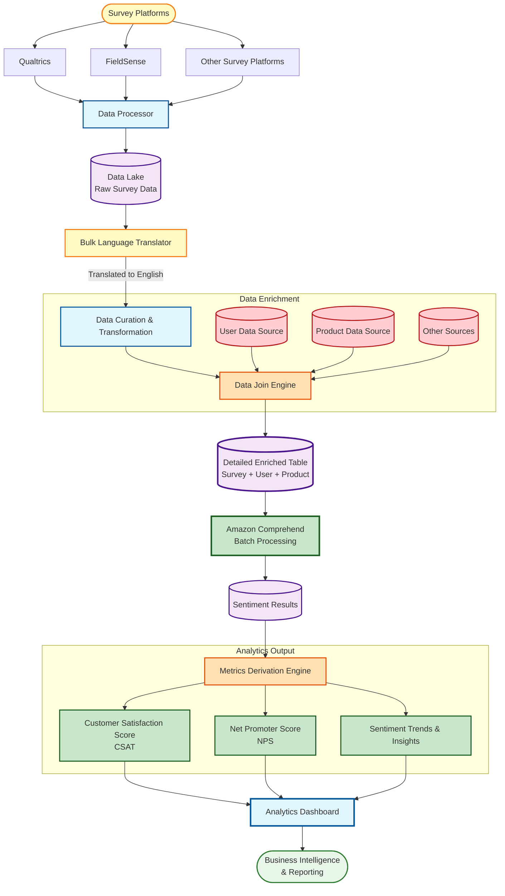

# Multilingual Feedback Analytics & Sentiment Intelligence - Architecture Diagram

## Mermaid Diagram Code



## Process Flow Description

### 1. Data Collection (Survey Platforms)

- **Purpose**: Collect customer feedback from multiple sources
- **Platforms**:
  - **Qualtrics**: Enterprise survey platform
  - **FieldSense**: Field feedback collection
  - **Other Survey Platforms**: Additional feedback channels
- **Output**: Raw survey responses in multiple languages

### 2. Data Processor

- **Purpose**: Ingest and standardize survey data from various platforms
- **Function**:
  - Validates incoming survey data
  - Standardizes data formats across platforms
  - Handles data quality checks
- **Output**: Unified raw survey data

### 3. Data Lake (Raw Survey Data)

- **Purpose**: Centralized storage for raw multilingual survey data
- **Storage**: S3-based data lake
- **Format**: Structured/semi-structured survey responses
- **Volume**: Handles 100K+ monthly survey responses

### 4. Bulk Language Translator

- **Purpose**: Translate all non-English feedback to English for consistent analysis
- **Process**:
  - Batch translation of survey responses
  - Supports 15+ languages
  - Preserves sentiment context during translation
- **Technology**: Amazon Translate
- **Output**: English-translated survey data

### 5. Data Curation & Transformation

- **Purpose**: Clean, validate, and prepare translated data for enrichment
- **Functions**:
  - Data cleansing (remove duplicates, handle nulls)
  - Format standardization
  - Data validation and quality checks
  - Schema transformation
- **Output**: Curated, clean survey data

### 6. Data Join Engine (Data Enrichment)

- **Purpose**: Enrich survey data with contextual information
- **Data Sources Joined**:
  - **User Data**: Demographics, role, location, history
  - **Product Data**: Training course details, metadata, categories
  - **Other Sources**: Enrollment data, completion rates, usage patterns
- **Process**: Multi-source join using user IDs, product IDs
- **Output**: Comprehensive enriched dataset

### 7. Detailed Enriched Table

- **Purpose**: Final consolidated dataset for sentiment analysis
- **Schema**: Survey + User + Product + Context
- **Storage**: Data warehouse (Redshift/Athena)
- **Structure**:
  - Survey responses
  - User demographics
  - Product information
  - Contextual metadata

### 8. Amazon Comprehend (Batch Processing)

- **Purpose**: AI-powered sentiment analysis at scale
- **Process**:
  - Batch sentiment analysis on enriched feedback
  - Entity recognition (product names, features)
  - Key phrase extraction
  - Language detection validation
- **Technology**: Amazon Comprehend
- **Output**: Sentiment scores (Positive, Negative, Neutral, Mixed)

### 9. Sentiment Results

- **Purpose**: Store sentiment analysis outputs
- **Data**:
  - Sentiment scores per response
  - Confidence levels
  - Detected entities and key phrases
- **Storage**: Data warehouse

### 10. Metrics Derivation Engine

- **Purpose**: Calculate business metrics from sentiment data
- **Calculations**:
  - **CSAT (Customer Satisfaction Score)**: Percentage of satisfied customers
  - **NPS (Net Promoter Score)**: Likelihood to recommend (-100 to +100)
  - **Sentiment Trends**: Time-series sentiment patterns
- **Aggregations**: By product, user segment, time period, region

### 11. Analytics Output

- **CSAT**: Customer Satisfaction Score for training content
- **NPS**: Net Promoter Score for AWS Training services
- **Sentiment Trends**: Actionable insights and trend analysis

### 12. Analytics Dashboard

- **Purpose**: Visualize insights for stakeholders
- **Features**:
  - Real-time CSAT/NPS tracking
  - Sentiment trend visualization
  - Product-level breakdowns
  - Regional/demographic analysis
- **Users**: Product managers, training content creators, leadership

### 13. Business Intelligence & Reporting

- **Purpose**: Enable data-driven decision making
- **Use Cases**:
  - Identify content improvement opportunities
  - Track training quality over time
  - Regional sentiment analysis
  - Product comparison and benchmarking

## Key Technologies

- **Survey Platforms**: Qualtrics, FieldSense
- **Data Lake**: Amazon S3
- **Translation**: Amazon Translate (15+ languages)
- **Data Processing**: AWS Glue, EMR
- **Sentiment Analysis**: Amazon Comprehend (batch processing)
- **Data Warehouse**: Amazon Redshift / Athena
- **Analytics**: QuickSight / Custom dashboards

## Pipeline Benefits

1. **Multilingual Support**: Automatically handles 15+ languages
2. **Scalability**: Batch processing for 100K+ monthly responses
3. **Data Enrichment**: Contextual user and product data for deeper insights
4. **Automated Metrics**: Real-time CSAT and NPS calculation
5. **Actionable Insights**: Identifies specific areas for training improvement

````

## Export Instructions

To generate PNG diagram:
1. Visit https://mermaid.live/
2. Paste the Mermaid code above
3. Use "Actions" → "Export as PNG" or "Export as SVG"
4. Save as `/assets/images/feedback_sentiment_analysis__architecture.png`
5. Update `modal.js` imageMap with:
   ```javascript
   'feedback-sentiment-analysis': {
     architecture: '/assets/images/feedback_sentiment_analysis__architecture.png',
   }
````
