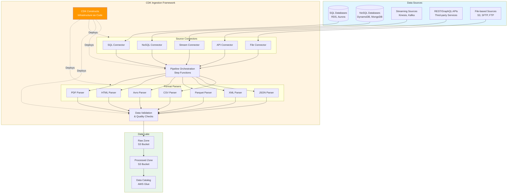
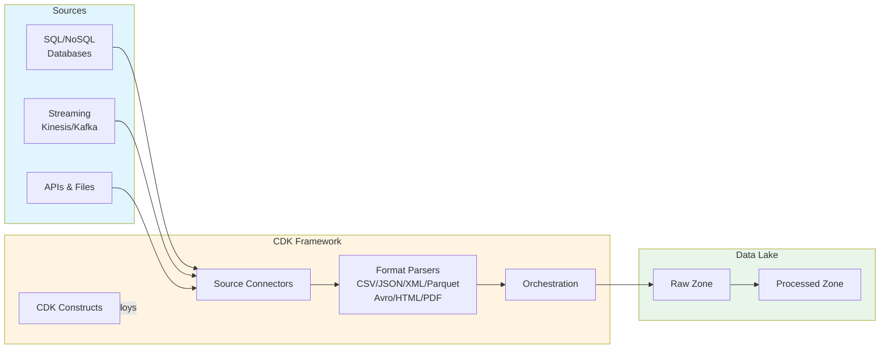

# Standardized Data Ingestion Framework - Architecture Diagram

## Mermaid Diagram Code

## Key Components

### 1. Data Sources (5 Types)

- **SQL Databases**: RDS, Aurora, PostgreSQL, MySQL
- **NoSQL Databases**: DynamoDB, MongoDB, Cassandra
- **Streaming Sources**: Kinesis Data Streams, Apache Kafka, MSK
- **REST/GraphQL APIs**: Third-party services, internal APIs
- **File-based Sources**: S3, SFTP, FTP servers

### 2. CDK Ingestion Framework

- **CDK Constructs**: Infrastructure as Code for repeatable deployments
- **Source Connectors**: Specialized connectors for each source type
- **Format Parsers**: Support for 7+ file formats
  - CSV, JSON, XML (structured)
  - Parquet, Avro (columnar)
  - HTML, PDF (semi-structured)
- **Pipeline Orchestration**: AWS Step Functions for workflow management
- **Data Validation**: Quality checks and schema validation

### 3. Data Lake Architecture

- **Raw Zone**: Landing area for ingested data (S3)
- **Processed Zone**: Cleaned and transformed data (S3)
- **Data Catalog**: AWS Glue for metadata management

## Impact Metrics

- **20% reduction** in development timeline
- **Standardized scaffolding** for initial pipeline development
- **10+ source types** supported
- **7 file formats** handled seamlessly
- **First-party and third-party** system integration

## Usage Instructions

1. Visit [Mermaid Live Editor](https://mermaid.live/)
2. Copy the mermaid code block above
3. Paste into the editor
4. Export as PNG or SVG
5. Save to `/assets/images/data_ingestion_framework__architecture.png`

## Alternative: Simplified View

For a more compact view, use this simplified version:

## Notes

- The framework supports both first-party (internal AWS services) and third-party systems
- CDK constructs enable rapid scaffolding of new ingestion pipelines
- Standardized approach reduces development time by 20%
- Infrastructure as Code ensures consistency across environments
