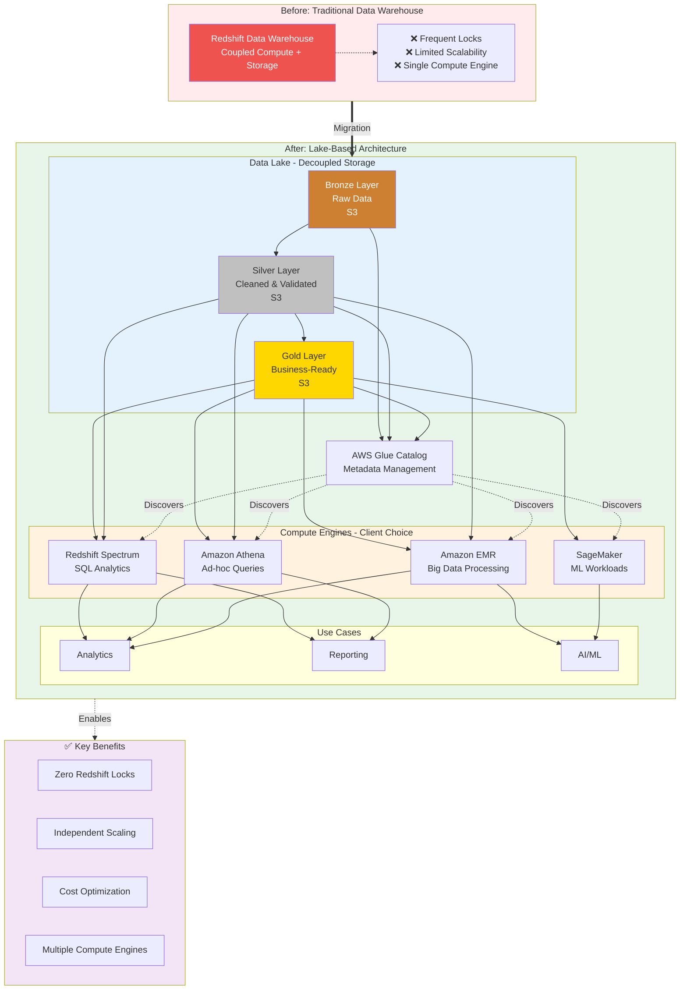
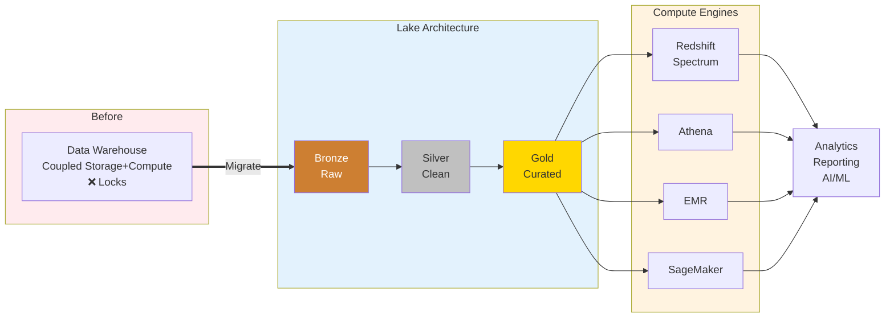

# Data Warehouse to Lake Migration - Architecture Diagram

## Mermaid Diagram Code

## Key Components

### 1. Before: Traditional Data Warehouse

- **Redshift Data Warehouse**: Tightly coupled compute and storage
- **Problems**:
  - Frequent locking issues during high concurrency
  - Limited scalability due to compute-storage coupling
  - Single compute engine for all workloads

### 2. After: Lake-Based Architecture

#### Medallion Architecture (Bronze → Silver → Gold)

- **Bronze Layer**: Raw data ingestion zone
  - Unprocessed data from source systems
  - Stored in S3 for cost-effective storage
  - Schema-on-read approach

- **Silver Layer**: Cleaned and validated data
  - Data quality checks applied
  - Standardized schemas
  - Deduplicated records
  - Ready for analytics

- **Gold Layer**: Business-ready aggregates
  - Curated datasets for specific use cases
  - Pre-aggregated metrics
  - Optimized for query performance
  - Production-ready data products

#### Compute Engines (Decoupled)

- **Redshift Spectrum**: SQL-based analytics on S3 data
- **Amazon Athena**: Serverless ad-hoc queries with standard SQL
- **Amazon EMR**: Distributed big data processing (Spark, Hive, Presto)
- **Amazon SageMaker**: Machine learning model training and inference

#### Metadata Management

- **AWS Glue Catalog**: Centralized metadata repository
  - Discovers and catalogs data across all layers
  - Provides unified view for all compute engines
  - Enables seamless data discovery

### 3. Use Cases Enabled

- **Analytics**: Business intelligence and data analysis
- **Reporting**: Scheduled reports and dashboards
- **AI/ML**: Model training, feature engineering, predictions

### 4. Key Benefits

- **Zero Redshift Locks**: Storage decoupled from compute eliminates concurrency issues
- **Independent Scaling**: Scale storage and compute independently based on needs
- **Cost Optimization**: Pay only for storage and compute when used
- **Multiple Compute Engines**: Teams choose best tool for their specific workload

## Impact Metrics

- **Zero Redshift Locks**: Eliminated all locking issues that occurred with coupled architecture
- **4+ Compute Engines**: Redshift Spectrum, Athena, EMR, SageMaker
- **3-Tier Data Quality**: Bronze (raw) → Silver (cleaned) → Gold (curated)
- **True Data-as-a-Service**: Self-service data access with engine of choice

## Architecture Highlights

### Decoupling Benefits

1. **Storage Independence**: Data persists in S3, independent of compute lifecycle
2. **Compute Elasticity**: Spin up/down compute resources as needed
3. **Cost Efficiency**: Store data once, query with multiple engines without duplication
4. **Workload Isolation**: Different workloads don't impact each other

### Medallion Architecture Benefits

1. **Data Quality Progression**: Clear path from raw to production-ready data
2. **Flexibility**: Users can query any layer based on their needs
3. **Auditability**: Complete lineage from source to consumption
4. **Reusability**: Same data serves multiple downstream consumers

### Data-as-a-Service Model

1. **Self-Service**: Users choose compute engine based on use case
2. **Consistent Metadata**: Glue Catalog provides unified view
3. **Governance**: Centralized access control and data quality
4. **Agility**: Faster time-to-insights with right tool for the job

## Usage Instructions

1. Visit [Mermaid Live Editor](https://mermaid.live/)
2. Copy the mermaid code block above
3. Paste into the editor
4. Export as PNG or SVG
5. Save to `/assets/images/data_warehouse_to_lake_migration__architecture.png`

## Alternative: Simplified View

For a more compact presentation view:

## Notes

- **Migration Strategy**: Phased approach from monolithic warehouse to distributed lake
- **No Data Duplication**: Single source of truth in S3, accessed by multiple engines
- **Governance**: AWS Lake Formation for fine-grained access control (optional)
- **Cost Model**: Pay-per-query (Athena), reserved capacity (Redshift Spectrum), or cluster-based (EMR)
- **Performance**: Gold layer optimized with partitioning and columnar formats (Parquet)
