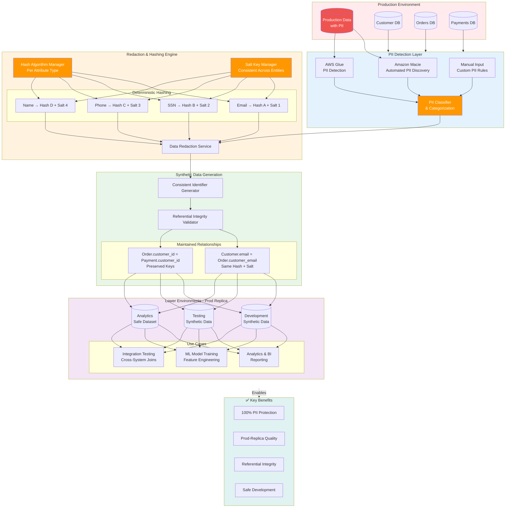
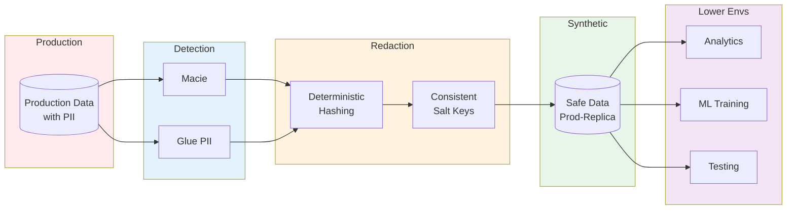

# PII Redaction & Synthetic Data Framework - Architecture Diagram

## Mermaid Diagram Code



## Key Components

### 1. Production Environment

- **Production Data with PII**: Real customer data containing sensitive information
- **Multiple Data Sources**:
  - Customer Database (names, emails, SSN, phone numbers)
  - Orders Database (customer references, payment info)
  - Payments Database (credit cards, billing addresses)

### 2. PII Detection Layer

#### Automated Detection Tools

- **Amazon Macie**: ML-powered PII discovery across S3 data lakes
- **AWS Glue PII Detection**: Catalog-based PII identification during ETL
- **Manual Input**: Custom business rules for domain-specific sensitive data

#### PII Classifier

- Categorizes detected PII by type (email, SSN, phone, name, etc.)
- Maps PII to appropriate redaction strategies
- Creates metadata for hash algorithm selection

### 3. Redaction & Hashing Engine

#### Hash Algorithm Manager

- Maintains separate hash algorithms per PII attribute type
- Ensures consistent hashing across all data sources
- Example: All emails use Hash Algorithm A

#### Salt Key Manager

- Manages cryptographic salts per attribute type
- Stores salts separately from data for security
- Same attribute type uses same salt across all entities

#### Deterministic Hashing Strategy

- **Email**: Hash Algorithm A + Salt Key 1
- **SSN**: Hash Algorithm B + Salt Key 2
- **Phone**: Hash Algorithm C + Salt Key 3
- **Name**: Hash Algorithm D + Salt Key 4

**Why Deterministic?**

- Same input always produces same output
- Enables joins across tables/systems
- Example: Customer.email and Order.customer_email hash to identical value

### 4. Synthetic Data Generation

#### Consistent Identifier Generator

- Creates synthetic values using deterministic hashing
- Maintains one-to-one mapping from real to synthetic
- Ensures uniqueness constraints preserved

#### Referential Integrity Validator

- Verifies foreign key relationships maintained
- Validates cross-table joins still work
- Confirms data quality metrics preserved

#### Maintained Relationships

- **Customer-Order Relationship**: Same customer email hashes identically in both tables
- **Order-Payment Relationship**: Customer IDs preserved across entities
- **Cross-System Joins**: Identical attributes use same hash/salt for join compatibility

### 5. Lower Environments (Prod-Replica)

#### Environment Types

- **Development**: Safe datasets for feature development
- **Testing**: Production-like data for QA validation
- **Analytics**: Sanitized data for business intelligence

#### Use Cases Enabled

1. **Analytics & BI Reporting**:
   - Safe dashboards using production-quality data
   - Real patterns without exposing PII

2. **ML Model Training**:
   - Feature engineering on realistic datasets
   - Model validation with production distribution

3. **Integration Testing**:
   - Cross-system join testing
   - End-to-end workflow validation

### 6. Key Benefits

- **100% PII Protection**: No sensitive data in lower environments
- **Prod-Replica Quality**: Maintains data distributions and patterns
- **Referential Integrity**: All relationships and joins preserved
- **Safe Development**: Teams work confidently without compliance risk

## Technical Deep Dive

### Deterministic Hashing Process

```
Input: customer@example.com
Hash Algorithm: SHA-256
Salt: "customer-email-salt-v1"

Process:
1. Concatenate: "customer@example.com" + "customer-email-salt-v1"
2. Hash: SHA-256("customer@example.comcustomer-email-salt-v1")
3. Output: "a3f5b8c2d1e9..."

Result: Same email always produces "a3f5b8c2d1e9..." across ALL tables/systems
```

### Cross-System Join Preservation

**Before Redaction (Production)**:

```sql
SELECT o.order_id, c.name
FROM customers c
JOIN orders o ON c.email = o.customer_email
```

**After Redaction (Lower Environments)**:

```sql
SELECT o.order_id, c.name_hash
FROM customers c
JOIN orders o ON c.email_hash = o.customer_email_hash
-- Still works! Both hashes are identical
```

### Hash & Salt Management

**Storage Strategy**:

- **Hash Algorithms**: Stored in configuration service (AWS Secrets Manager)
- **Salt Keys**: Versioned and rotated periodically (AWS KMS)
- **Mapping Metadata**: Tracked in data catalog (AWS Glue)

**Security Benefits**:

- Salts prevent rainbow table attacks
- Separate storage prevents reverse engineering
- Algorithm rotation capability for compliance

## Impact Metrics

- **100% PII Protection**: Zero sensitive data exposure in lower environments
- **Production-Replica Datasets**: Maintains statistical properties and distributions
- **Referential Integrity**: All foreign key relationships preserved
- **Cross-System Joins**: Same attributes use identical hash/salt combinations
- **Compliance**: GDPR, CCPA, HIPAA compliant data handling
- **Developer Velocity**: Safe, realistic data accelerates development cycles

## Architecture Highlights

### Data Mesh Compatibility

1. **Decentralized Data Ownership**: Each domain manages its own PII redaction
2. **Federated Governance**: Centralized hash/salt management ensures consistency
3. **Self-Service**: Teams generate synthetic data on-demand
4. **Interoperability**: Consistent hashing enables cross-domain joins

### Automated Pipeline

1. **Source Data Ingestion**: Production data extracted
2. **PII Detection**: Macie + Glue scan for sensitive fields
3. **Classification**: PII categorized by type
4. **Hash Assignment**: Algorithm + salt selected per attribute
5. **Redaction**: Deterministic hashing applied
6. **Validation**: Referential integrity verified
7. **Distribution**: Synthetic data deployed to lower environments

## Usage Instructions

1. Visit [Mermaid Live Editor](https://mermaid.live/)
2. Copy the mermaid code block above
3. Paste into the editor
4. Export as PNG or SVG
5. Save to `/assets/images/pii_redaction_synthetic_data_framework__architecture.png`

## Alternative: Simplified View

For a more compact presentation view:



## Notes

- **Hash Consistency**: Critical for maintaining joins across distributed data mesh
- **Salt Versioning**: Enables periodic rotation without breaking existing datasets
- **Automated Detection**: Reduces manual effort and human error in PII identification
- **Reversibility**: One-way hashing ensures data cannot be de-anonymized
- **Performance**: Deterministic hashing is computationally efficient for large datasets
- **Compliance**: Meets regulatory requirements (GDPR, CCPA, HIPAA) for data protection

## Related Technologies

- **Amazon Macie**: ML-based PII discovery
- **AWS Glue**: PII detection in data catalog
- **AWS Secrets Manager**: Hash algorithm configuration
- **AWS KMS**: Salt key encryption and rotation
- **AWS Lake Formation**: Fine-grained access control
- **Amazon S3**: Secure storage for synthetic datasets
