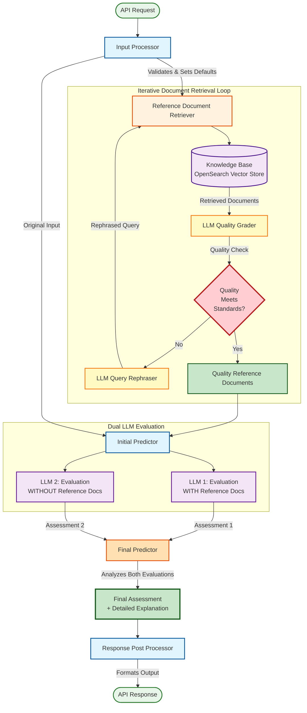

# AI-Generated Content Evaluation Service - Architecture Diagram

## Mermaid Diagram Code



## Process Flow Description

### 1. Input Processor

- **Purpose**: Validates incoming API requests
- **Function**: Fills missing optional fields with default values
- **Output**: Validated input data

### 2. Reference Document Retriever (Iterative Loop)

- **Purpose**: Obtain high-quality reference materials
- **Process**:
  1. Fetches documents from Knowledge Base (OpenSearch Vector Store)
  2. LLM Quality Grader evaluates document relevance/quality
  3. If quality standards not met:
     - LLM Query Rephraser reformulates the query
     - Process restarts with new query
  4. If quality standards met:
     - Proceeds with quality reference documents

### 3. Initial Predictor (Dual LLM Evaluation)

- **Purpose**: Generate initial content assessments
- **Inputs**:
  - Original input from Input Processor
  - Quality reference documents from retriever
- **Process**:
  - **LLM 1**: Evaluates content WITH reference documents
  - **LLM 2**: Evaluates content WITHOUT reference documents
- **Output**: Two independent assessments

### 4. Final Predictor

- **Purpose**: Synthesize final judgment
- **Process**: Analyzes both LLM evaluations (with/without references)
- **Output**:
  - Final assessment score/verdict
  - Detailed explanation of correctness

### 5. Response Post Processor

- **Purpose**: Format and standardize output
- **Function**: Handles LLM output formatting
- **Output**: Structured API response to caller

## Key Technologies

- **OpenSearch**: Vector storage for AWS documentation knowledge base
- **Amazon Bedrock**: LLM inference for quality grading, rephrasing, and evaluation
- **Multi-LLM Architecture**: Dual evaluation (with/without context) for robust assessment

## Iterative Quality Loop Benefit

The iterative document retrieval ensures that the evaluation is based on the most relevant and accurate AWS documentation, improving the reliability of the LLM-as-a-judge correctness metrics.

````

## Export Instructions

To generate PNG diagram:
1. Visit https://mermaid.live/
2. Paste the Mermaid code above
3. Use "Actions" → "Export as PNG" or "Export as SVG"
4. Save as `/assets/images/ai_content_evaluation__architecture.png`
5. Update `modal.js` imageMap with:
   ```javascript
   'ai-content-evaluation': {
     architecture: '/assets/images/ai_content_evaluation__architecture.png',
   }
````
