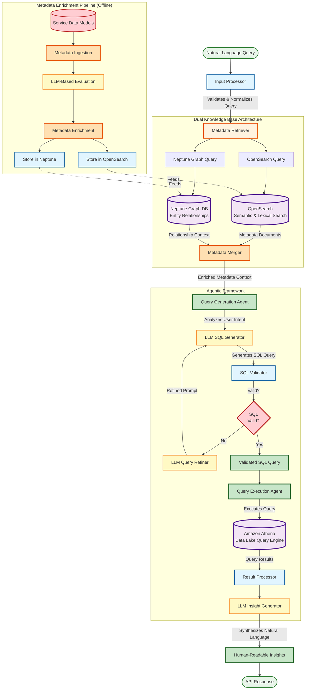

# Data Sense - Intelligent Data Lake Query Service - Architecture Diagram

## Mermaid Diagram Code



## Process Flow Description

### 1. Input Processor

- **Purpose**: Receive and validate natural language queries from users
- **Function**:
  - Validates incoming query format
  - Normalizes query text
  - Prepares query for metadata retrieval
- **Output**: Validated natural language query

### 2. Metadata Retriever (Dual Knowledge Base)

- **Purpose**: Retrieve relevant data lake metadata from dual knowledge bases
- **Process**:
  - **OpenSearch Query**: Performs semantic and lexical search on metadata documents
  - **Neptune Graph Query**: Traverses entity relationships to understand data context
- **Data Sources**:
  - **OpenSearch**: Stores metadata as vector embeddings for semantic search
  - **Neptune Graph DB**: Maintains entity relationships and dependencies
- **Output**: Metadata from both sources

### 3. Metadata Merger

- **Purpose**: Combine metadata from OpenSearch and Neptune into unified context
- **Function**:
  - Merges semantic search results with relationship context
  - Deduplicates and ranks metadata by relevance
  - Creates comprehensive metadata context for query generation
- **Output**: Enriched metadata context

### 4. Query Generation Agent (Agentic Framework)

- **Purpose**: Translate natural language query to SQL using metadata context
- **Process**:
  1. **Analyzes User Intent**: Uses LLM to understand what user is asking for
  2. **LLM SQL Generator**: Generates SQL query based on intent and metadata
  3. **SQL Validator**: Validates SQL syntax and semantic correctness
  4. **Decision**: Checks if SQL is valid
  5. **LLM Query Refiner** (if invalid): Refines prompt and regenerates SQL
  6. **Validated SQL Query**: Final SQL ready for execution
- **Technology**: Amazon Bedrock for LLM inference
- **Output**: Validated SQL query

### 5. Query Execution Agent

- **Purpose**: Execute SQL query and process results
- **Process**:
  - Executes validated SQL query in Amazon Athena
  - Retrieves query results from data lake
  - Processes results for insight generation
- **Technology**: Amazon Athena (serverless query engine for S3 data lakes)
- **Output**: Raw query results

### 6. Result Processor

- **Purpose**: Prepare query results for natural language synthesis
- **Function**:
  - Formats query results
  - Identifies key patterns and insights
  - Prepares data for LLM insight generation
- **Output**: Processed results

### 7. LLM Insight Generator

- **Purpose**: Transform raw query results into human-readable insights
- **Process**:
  - Uses LLM to analyze query results
  - Generates natural language explanations
  - Highlights key findings and patterns
  - Creates actionable recommendations
- **Technology**: Amazon Bedrock
- **Output**: Human-readable insights in natural language

### 8. Metadata Enrichment Pipeline (Offline Process)

- **Purpose**: Continuously enrich and maintain metadata in knowledge bases
- **Process**:
  1. **Service Data Models**: Source data model definitions from services
  2. **Metadata Ingestion**: Ingest metadata from various data sources
  3. **LLM-Based Evaluation**: Use LLM to evaluate and enhance metadata quality
  4. **Metadata Enrichment**: Add descriptions, tags, relationships, business context
  5. **Store in OpenSearch**: Index enriched metadata as vector embeddings
  6. **Store in Neptune**: Store entity relationships in graph database
- **Frequency**: Runs on schedule or triggered by data model changes
- **Technology**: AWS Glue, Amazon Bedrock, OpenSearch, Neptune

## Key Technologies

- **Natural Language Processing**: Amazon Bedrock (Claude, other LLMs)
- **Semantic Search**: Amazon OpenSearch (vector embeddings)
- **Graph Database**: Amazon Neptune (entity relationships)
- **Query Engine**: Amazon Athena (serverless SQL on S3 data lakes)
- **Metadata Enrichment**: AWS Glue, Amazon Bedrock
- **Agentic Framework**: Multi-agent orchestration with LLM-powered agents

## Agentic Framework Benefits

1. **Query Generation Agent**: Specializes in understanding user intent and generating accurate SQL
2. **Query Execution Agent**: Focuses on executing queries and processing results
3. **Separation of Concerns**: Each agent handles specific responsibilities
4. **Iterative Refinement**: Query refinement loop ensures high-quality SQL generation
5. **Context-Aware**: Dual knowledge base provides rich metadata context

## System Benefits

1. **Zero SQL Knowledge Required**: Users ask questions in natural language
2. **10x Faster Data Discovery**: Automated query generation vs manual SQL writing
3. **Dual Knowledge Base**: Combines semantic search (OpenSearch) with relationship context (Neptune)
4. **High-Quality Metadata**: Rigorous LLM-based evaluation and enrichment
5. **Actionable Insights**: Natural language insights, not just raw data
6. **Scalable**: Serverless Athena queries across petabyte-scale data lakes

## Export Instructions

To generate PNG diagram:

1. Visit https://mermaid.live/
2. Paste the Mermaid code above
3. Use "Actions" → "Export as PNG" or "Export as SVG"
4. Save as `/assets/images/data_sense__architecture.png`
5. Update `modal.js` imageMap with:
   ```javascript
   'data-sense': {
     architecture: '/assets/images/data_sense__architecture.png',
   }
   ```
